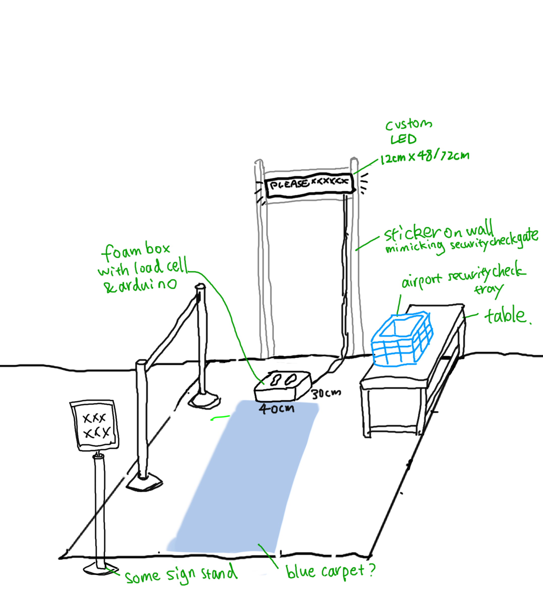
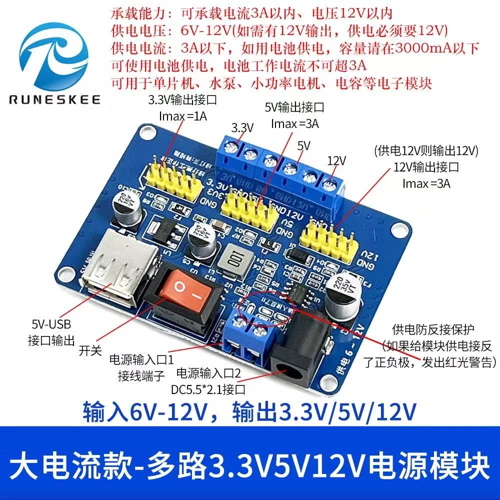

# borderControl
amaze 2026

### Index
#### 一 游戏流程介绍
#### 二 设备完整接线图（和电子器件清单）
#### 三 接口细节
#### 四 一些常见问题的解决方式和可能原因
#### 五 代码链接。代码的架构（如何修改调整排版）
#### 六 新电脑如何安装库与注意事项
---

### 一 游戏流程 

1. 玩家站到称上激活游戏（检测到大于25kg的重量开始游戏界面）
2. 玩家站立不动，自动播放游戏介绍跟流程，每个页面停留4秒（三选一主题）
3. 进入关卡：每关播放题目，右下角倒数10秒。
4. 关卡结算：10秒后冻结重量，计算差值，播放结果停留4秒后，进入下一关卡。
5. 所有关卡流程结束后，计算总分，总分界面停留10秒，如果通过游戏，亮起绿灯；如果不能通过，亮起红灯
6. 最后进入排行榜界面
---

### 二 设备完整接线图（和电子器件清单）

R1_PIN_DEFAULT 4  
G1_PIN_DEFAULT 5  
B1_PIN_DEFAULT 6  
R2_PIN_DEFAULT 7 
G2_PIN_DEFAULT 15 
B2_PIN_DEFAULT 16 
A_PIN_DEFAULT  18 
B_PIN_DEFAULT  8 
C_PIN_DEFAULT  3 
D_PIN_DEFAULT  42 
E_PIN_DEFAULT  17 // required for 1/32 scan panels 
LAT_PIN_DEFAULT 40 
OE_PIN_DEFAULT  2 
CLK_PIN_DEFAULT 41 

称的部分: 
VCC 需要接5v 
HX711_SCK 13  // PORTA0 (esp32 S3) 
HX711_DT 14   // PORTL (esp32 S3) 
GND

---

### 三 图片

---

### 四 一些常见问题的解决方式和可能原因

---

### 五 代码链接。代码的架构（如何修改调整排版）

1. 测试屏幕可以先用borderControl\borderControl_game\examples\2_PatternPlasma\2_PatternPlasma.ino
2. 测试屏幕、灯、称的连接和现实可以使用borderControl\borderControl_game\src\test_matrix\test_matrix.ino
3. 完整程序在borderControl\borderControl_game\src\main.ino
---

### 六 新电脑如何安装库与注意事项 

todo
1. 称校准。
    称的安装（30min）
    系数校准（30min）
    电路是否增加电容（1h）（优先级低）
2. 整体架构（能快速找出问题，方便模块化修改）(优先级低)
   硬件功能测试

3. 游戏功能测试（30min-1h）
4. 扩展游戏，增加承重选项（非编程，1h）
5. 整体游戏测试，全游戏流程测试（1h）

6. 布线设计 优化（2h）
7. 模块化文档（2h）