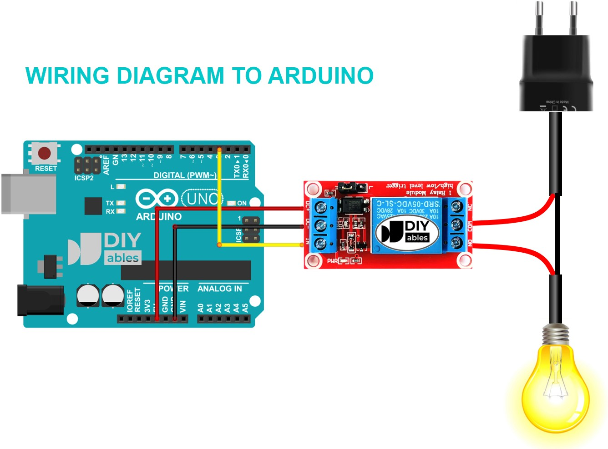
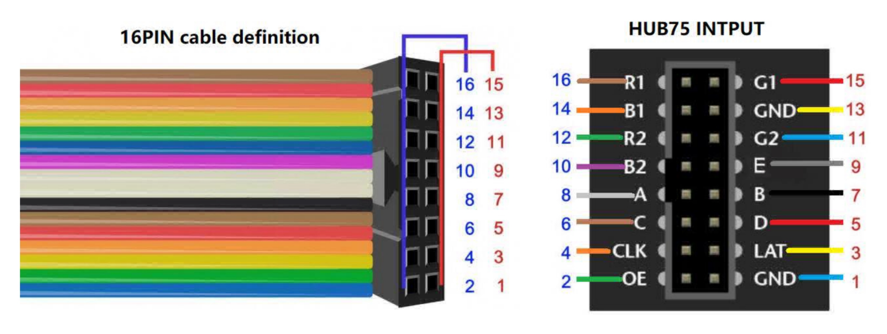

# borderControl
amaze 2026

### Index
#### 一 游戏流程介绍
#### 二 设备完整接线图（和电子器件清单）
#### 三 接口细节
#### 四 一些常见问题的解决方式和可能原因
#### 五 代码链接。代码的架构（如何修改调整排版）
#### 六 新电脑如何安装库与注意事项
---

### 一 游戏流程与页面说明

#### 1. 总流程

`START` → `INTRO 1~5` → `LEVEL 1~8`（每关 2 页：`PROMPT` + `RESULT`）→ `FINAL` → `ACCESS RESULT` → `LEADERBOARD` → `START`

#### 2. 详细规则

1. 等待玩家：
显示最开始的界面：
（第一行）BORDER CONTROL!
（第三行）PLEASE STEP ON
玩家站到称上激活游戏（检测到大于25kg的重量开始介绍界面INTRO）。
2. 游戏介绍：
玩家在称上站立不动，屏幕自动播放游戏介绍跟流程，每个页面停留4秒。
3. 进入关卡：
依次进入八个关卡：从第一关开始，随机三选一题目，播放题目文字，右下角显示倒数10秒。
4. 关卡结算：
10s倒计时结束后，冻结重量，把重量在右下角显示，计算和上一关卡重量的差值。将这个差值和题目的重量比较。显示结果页面RESULT（附上差值），结果页面停留6秒后（不显示计时），进入下一关卡。
5. 所有关卡结束：
八个关卡流程结束后，计算总体偏差值，final界面停留10秒。进入下一个审核页面。
6. 审核判定：
如果final error小于5000g则通过游戏，显示：“Access Granted.”（绿色字）并亮起绿灯；如果不能通过（大于5000g），显示“Access Denied.”(红色字)，亮起红灯。
7. 排行榜与重置：
最后进入排行榜界面，显示最佳的三个分数。最左侧显示BEST：右侧显示三行分数，没有最佳则用xxx替代。停留20秒并且直到等待玩家离开承重区域（小于25kg的重量），回到最开始的界面，等待新的玩家到来。

#### 3. 各页面显示内容

| 页面 | 显示内容 | 说明 |
| --- | --- | --- |
| `START` | `BORDER CONTROL` `PLEASE STEP ON` `THE SCALE` | 初始等待页，红字。 |
| `INTRO 1` | `WELCOME TO THE PORT OF ENTRY` | 游戏介绍页。 |
| `INTRO 2` | `step on scale with all your things` | 游戏介绍页。 |
| `INTRO 3` | `do not remove anything yet` | 游戏介绍页。 |
| `INTRO 4` | `...` | 游戏介绍页。 |
| `INTRO 5` | `forbidden items found` | 游戏介绍页。 |
| `LEVEL n / PROMPT` | `discard: <item>` | 每关从 3 个候选题目里随机抽 1 个；进入第一关题目页时，当前重量会作为基准值。 |
| `LEVEL n / RESULT` | `close. off by <error>g` | 显示当前关卡误差。 |
| `FINAL` | `final error <total>g` | 显示总误差，绿色字。 |
| `ACCESS RESULT` | `Access Granted.` / `Access Denied.` | `final error < 5000g` 为通过，绿色字并亮绿灯；否则红字并亮红灯。 |
| `LEADERBOARD` | 左侧大字 `BEST`，右侧三行 `1.` `2.` `3.` 分数 | 显示历史最佳 3 个分数，空位显示 `xxx`。页面停留 20 秒后回到 `START`。 |

#### 4. 通过条件

- 通过阈值放在 `borderControl_game/src/main/config.h` 里的 `PASS_THRESHOLD_G`。
- 当前规则是：`final error < PASS_THRESHOLD_G` 即通过。
---

### 二 设备完整接线图（和电子器件清单）

R1_PIN_DEFAULT 4  
G1_PIN_DEFAULT 5  
B1_PIN_DEFAULT 6  
R2_PIN_DEFAULT 7 
G2_PIN_DEFAULT 15 
B2_PIN_DEFAULT 16 
A_PIN_DEFAULT  18 
B_PIN_DEFAULT  8 
C_PIN_DEFAULT  3 
D_PIN_DEFAULT  42 
E_PIN_DEFAULT  17 // required for 1/32 scan panels 
LAT_PIN_DEFAULT 40 
OE_PIN_DEFAULT  2 
CLK_PIN_DEFAULT 41 

称的部分: 
VCC 需要接5v 
HX711_SCK 13  // PORTA0 (esp32 S3) 
HX711_DT 14   // PORTL (esp32 S3) 
GND

---

### 三 图片

---

### 四 一些常见问题的解决方式和可能原因

---

### 五 代码链接。代码的架构（如何修改调整排版）

#### 1. 从哪里开始看
1. 只测试屏幕动画：`borderControl\borderControl_game\src\test_pix\2_PatternPlasma.ino`
2. 测试屏幕、灯、称是否都正常：`borderControl\borderControl_game\src\test_matrix\test_matrix.ino`
3. 正式游戏程序入口：`borderControl\borderControl_game\src\main\main.ino`
4. `borderControl\borderControl_game\src\test\test.ino` 是较早的一体化版本，现在主要作为旧逻辑参考，不是当前主入口。

#### 2. 正式程序的文件分工
- `borderControl_game\src\main\main.ino`
  - 程序入口。
  - `setup()` 负责初始化屏幕、红绿灯、HX711，并做两次 tare。
  - `loop()` 里有两个主要节奏：按 `WEIGHT_INTERVAL_MS` 读取重量；按页面规则自动切页。
  - `displayPage()` 是总路由，决定当前显示开始页、介绍页、题目页、结果页、总分页、通过/未通过页、排行榜页。
  - `calcScore()` 负责算当前关卡误差，`updateLeaderboard()` 负责更新排行榜。
- `borderControl_game\src\main\config.h`
  - 所有全局参数都在这里：引脚、屏幕尺寸、称的校准系数 `HX711_GAP`、页面时间、关卡数量、intro 数量、排行榜大小、通过阈值 `PASS_THRESHOLD_G`。
  - 想改节奏、页数、硬件参数，优先先看这个文件。
- `borderControl_game\src\main\game_content.h / game_content.cpp`
  - 放游戏内容数据。
  - `INTRO_TEXTS` 是开场文案。
  - `LEVELS` 是每一关的题目和标准重量；每关有 `QUESTIONS_PER_LEVEL` 个变体，开局随机抽一个。
  - 想改题目文字、物品名字、标准克重，主要改这里。
- `borderControl_game\src\main\display.h / display.cpp`
  - 纯显示层，不做分数和流程判断。
  - 负责画不同页面，以及排行榜页的专用排版。
  - 想改排版、字号、颜色、换行、文字位置，主要改这里。
- `borderControl_game\src\main\HX711.h / HX711.cpp`
  - 称重驱动。
  - `begin()` 会记录空载基准，`Get_Weight()` 返回当前克重。
  - 这里加了临界区保护，避免 LED DMA 刷屏打断 HX711 读数。
  - 如果称不稳、读数异常，优先看这里。

#### 3. 当前程序实际流程（以 `borderControl_game\src\main\main.ino` 为准）
`PAGE_START` → 5 页 intro → 8 关 ×（题目页 + 结果页）→ 总分页 → 排行榜页 → 回到开始页

补充说明：
- 当前版本是统一定时自动翻页，页间隔由 `PAGE_AUTO_INTERVAL_MS` 控制，默认 10000ms。
- 当前版本会持续读取重量，并在右下角显示 debug 重量。
- 第 1 个题目页会把当时的重量记为基准；每次进入结果页时，用前后重量差和题目标准重量比较，累计误差分数。

#### 4. 常见修改对应改哪里
- 改文案：`game_content.cpp`
- 改题目和标准重量：`game_content.cpp` 里的 `LEVELS`
- 改页数、时间、硬件参数、校准系数：`config.h`
- 改页面排版、颜色、字体大小、位置：`display.cpp`
- 改流程推进方式、计分逻辑、排行榜逻辑：`main.ino`
- 改称重底层读取方式：`HX711.cpp`

#### 5. 哪些文件通常不要动
- `borderControl_game\src\ESP32-HUB75-MatrixPanel-I2S-DMA.*`
- `borderControl_game\src\ESP32-HUB75-VirtualMatrixPanel_T.hpp`
- `borderControl_game\src\ESP32-VirtualMatrixPanel-I2S-DMA.h`
- `borderControl_game\src\platforms\...`
- `borderControl_game\src\cie_luts.h`

这些基本是 HUB75 屏幕驱动库源码。除非你在修底层驱动问题，否则平时改 `src\main` 下面几个文件就够了。
---

### 六 新电脑如何安装库与注意事项 

todo
<!-- 1. 称校准。
    称的安装（30min）
    系数校准（30min）
    解决走线过长数据不稳问题（1h）
    电路是否增加电容（1h）（优先级低）
2. 整体架构（能快速找出问题，方便模块化修改）(优先级低)
   硬件功能测试（1h）

3. 游戏功能测试（30min-1h）
4. 扩展游戏，增加承重选项（非编程，1h）
5. 整体游戏测试，全游戏流程测试（1h）
6. 布线设计 优化（2h）
7. 模块化文档（2h）